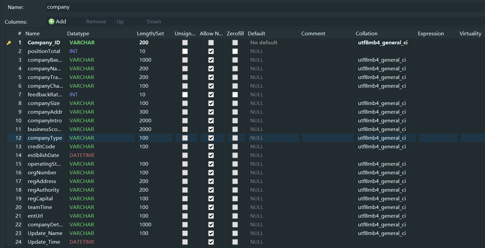
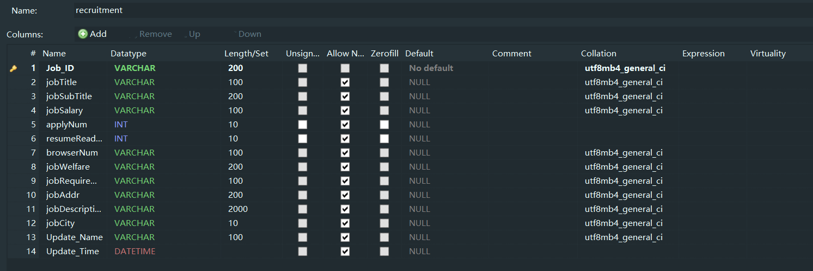
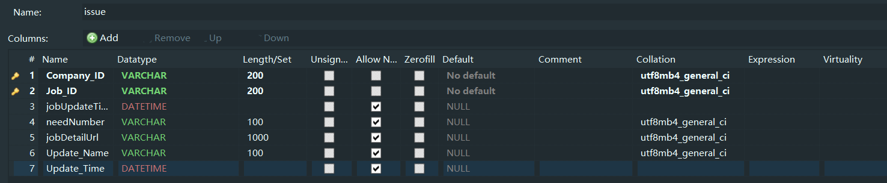
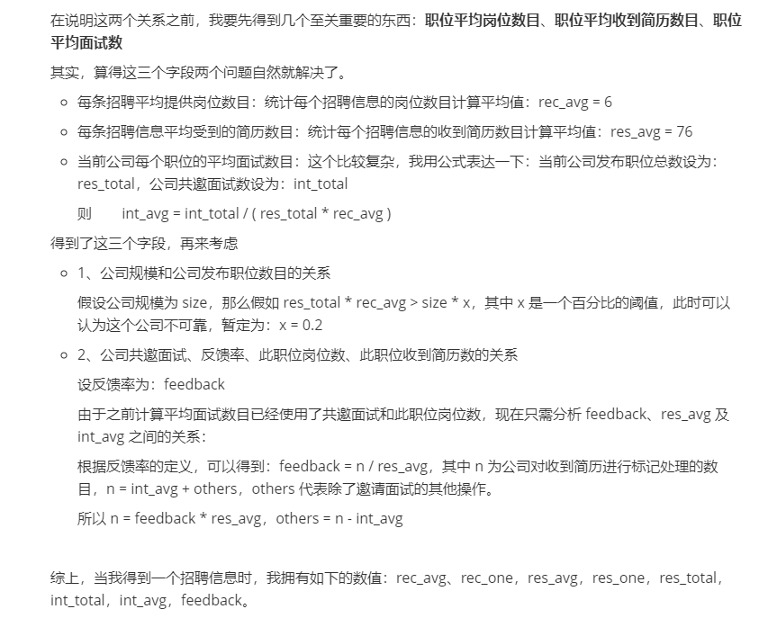

## 58同城数据库详细说明及分析

我将通过提问题及解决问题的方式来叙述本篇介绍

### 一、

**问：**

58 同城招聘信息存储的数据库长什么样？

**答：**

我将所有信息非为三个表：company、recruitment、issue

1. company：只与公司相关的信息字段
2. recruitment：网页上招聘详情页只与招聘相关的信息字段
3. issue：公司与招聘职位的联系集——发布，公司发布职位，存放两者相关联的信息字段

三个表的详细请看下面三个图：

关于每个字段的详细说明和分析，我要放到后面说

### 二、

**问：**

为什么要这么建库？建成两个表不可以吗？还有之前说的以公司信息为主的爬虫方式和这个数据库有什么关系？

**答：**

第一个和第二个问题一起来回答，我的目的是这样的，假如我只想单独分析公司信息，那么我不想在公司信息里面看到和公司无关的东西，同理，单独分析招聘职位也是。

​	我们可以主要来看一下 **issue** 这个表，**jobUpdateTime**、**needNumber** 分别代表公司对这个职位最后一次更新的时间、公司发布这个职位提供了多少岗位，显然，这两个属性不是独立的，公司和职位是相关的，所以我要把它们，放到联系集；

​	而 **jobDetailUrl** 这个属性显然和职位无关，所以要放到联系集里；

​	你可能会问，公司的链接为什么放在公司的表里，首先这是因为我不想存放过多重复的数据、其次是公司详情爬虫可能会出问题，这个是为了查验方便。

第三个问题很有意思，也是一个与之前智联招聘迥然不同的数据组织方式，以公司的方式组织数据有以下几个好处：

1. 当我们在考虑一条招聘信息是否虚假的时候，我们可能忽略了很重要的一点——发布这条招聘的公司是否也是欺诈公司呢？所以，为了更好的研究这个问题，我们需要以公司为单位获取这个公司发布的所有职位；

   ​	我举个生动一点的例子，假如一家公司发布了 20 个职位，经过人工判别之后，对其中 5 条信息感到怀疑或者说直接一点，就是这家公司发布的 20 个职位之中确定了有 5 条是假的，而另外 15 条以我们事先规定的客观规则无法判断真假甚至判断为真，那么将这个判断结果综合考虑一下，是否可以认为这家公司不可信，那么之前无法判别的 15 条是不是可以认为是虚假的呢？

   ​	这是这样组织数据的第一个好处，也是很关键的一个好处，通过这种方式，我们从之前只可以单一分析一条数据升级为可以对一定数目的招聘信息进行综合分析，甚至可以通过公司的虚假招聘数目而推断公司的另一部分招聘也为假，等等等等。

2. 第二个好处是这种方式可以更好的与一些现有的属性结合起来分析，而不必去依靠可能对结果产生巨大影响的统计数据。还记不记得上次智联招聘的那个分析，如果忘了，请看下图：

   

   ​	你不必仔细读上面图里的文字，因为它过时了，你只需了解在建立智联招聘数据库时选择的数据组织方式为：以招聘信息为主，但是当我们更换数据组织方式之后，上图提到的所有和统计相关的数字都不需要了，因为我们现在都有了，完全不需要再对数据进行统计，比如我们想得到一个公司发布职位平均提供的岗位数只需将这个公司所有职位岗位数相加再求平均数，而不需计算整个数据库的岗位数平均值，等等等等。

   ​	所以现在我们可以放心的将现有的数据结合其他数据进行分析，不需担心数值的准确度对结果有影响，因为这些数据都是正确且存在的，具体如何结合后面说

3. 还有很多好处，也不必细说，慢慢体会便知。

### 三、

**问：**

数据库中有没有一些比较特殊的字段，就是那种很重要又不是很容易利用的字段？

**答：**

这个我不想单独选择介绍一个或者几个，小孩子才做选择，我全都要

不如全都说一下得了

1. company

   **58 同城自己拥有的**

   - Company_ID：公司 ID
   - positionTotal：公司发布职位数，这里有多少，招聘表和发布联系集关于这个公司的信息数目就有多少
   - companyBaseUrl：公司 58 同城基本信息页
   - companyName：公司名字
   - companyTrade：公司行业，由于 58 同城网页改版，原本这个字段是有数据的，现在全是未知
   - companyCharacter：公司性质：民营、国企等等
   - feedbackRation：公司反馈率，这个对公司发布的所有职位都是相同的，代表没收到一份简历投递这个公司对这个简历进行标记操作处理的概率，标记操作就是查看简历修改简历的状态为：可面试、不合适、待定等等状态。也可以理解为，100 个人投递这家公司，其中有 100 * feedbackRation 人收到了这家公司的回应
   - companySize：公司规模，也就是员工规模，如100-499人
   - companyAddr：公司详细地址
   - companyIntro：公司介绍
   - companyType：同样由于 58 改版，现在全为未知
   - teamTime：经营期限，我全设为了"_"，其实可以默认为成立日期-至今，但是假如这样默认很不严谨
   - entUrl：公司天眼查网址，受改版影响，现在无法获取，全为未知，其实可以获取到，但是我觉得没必要折腾
   - companyDetailUrl：这个是公司自己提供的官方网址，一般没有

   **58 同城从天眼查接口获取的**

   - businessScope：公司经营范围，这个字段其实挺可疑，58 同城是从天眼查上面获取的
   - creditCode：公司统一社会信用代码，不知道干嘛的，有的公司没有
   - estiblishDate：公司成立日期，假如公司成立日期不存在，我都将其设为：1800-12-31
   - operatingStatus：公司经营状态：开业、存续等等，这个字段应该会有用，但是我现在对开业和存续等的概念不是很了解
   - orgNumber：组织机构代码，同样不知道
   - regAddress：注册地址
   - regAuthority：注册机构
   - regCapital：注册资本

2. recruitment

   - Job_ID：职位 ID
   - jobTitle：工作标题，一般较为正常，描述职位的行业或者特定名称，这个标题应该是公司按照 58 要求设定的
   - jobSubTitle：工作子标题，一般不太正常，这个子标题应该为公司自定义，一般为描述工资、福利等等信息，是个很重要的字段
   - jobSalary：薪资，一般为一个范围
   - applyNum：申请人数，即投递简历人数
   - resumeReadPercent：简历阅读百分比，这个和反馈率类似，顾名思义表示投递一个简历被阅读到的概率，在58 同城网页上面，有的这个职位的简历阅读百分比，有的显示公司的反馈率，显示规则不清楚。但是这个字段和反馈率关系密切，上面说了反馈率是阅读之后再对简历进行标记，而阅读率仅仅是阅读，既包括被标记的简历也包括未被标记的，所以一般阅读率 >= 反馈率，这个规律从数据库中也看得出
   - browserNum：招聘信息浏览量，58 同城可能对这个数字的加载进行了 AJAX 处理，当初写代码的时候没注意到，所以现在所有浏览量都为 0，这个赖我
   - jobWelfare：工作福利，格式为：包吃_ 包住 _ 节日福利 _ 员工聚餐 _ 近地铁
   - jobRequirement：工作要求，为学历和工作经验要求，格式为：学历不限_经验不限
   - jobAddr：工作详细地址，格式为：广州_ 白云_ 嘉禾望岗_ 广州白云嘉禾望岗空港大道润林大厦506
   - jobDescription：工作描述
   - jobCity：爬取信息所选的城市：bj、sh、gz、sz

3. issue

   - jobUpdateTime：公司更新这条职位的时间，只精确到天，其实详情页可以精确到分钟，但是我没有存
   - needNumber：公司发布这条职位提供的岗位数目
   - jobDetailUrl：职位招聘详情页链接

​	介绍了所有数据库字段，我并不想直接判断哪个字段肯定没有用（除了那些全都一样的），也不想详细解释每个字段在虚假招聘判断过程中起到的作用，我更希望你看完以上介绍之后可以自己得出这些结论——这才是关键。

​	不过我还是解答一下之前问题，那几个比较特殊的字段，不过我不会具体解释哪里特殊，这个需要你自己体会，当然你也应该添加一些自己认为特殊的其他字段：

 	1. company.positionTotal、company.companySize 和 issue.needNumber
 	2. recruitment.applyNum、recruitment.resumeReadPercent 和 company.feedbackRation
 	3. jobRequirement 和 jobSalary
 	4. jobTitle 和 jobDescription
 	5. businessScope
 	6. jobSubTitle
 	7. .............

**关于 58 同城招聘信息数据库的说明这些差不多足够了**

**需要注意的是，文中我省略叙述了一些东西，这些东西往往是比较重要的**

