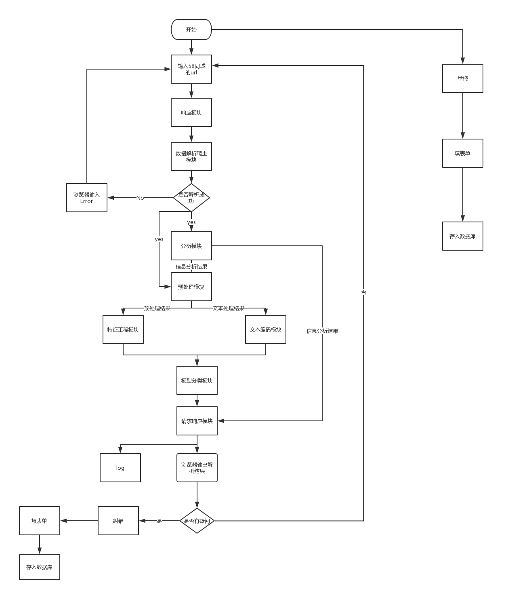

## The Online Recruitment Fraud Detection Documentation

This is our project documention of the 2019 national information security competition

## 项目论文

前往：[论文](./issue/基于机器学习的在线招聘欺诈检测平台.pdf)

## 项目数据集

地址：[Excels](https://github.com/zjh567/orfd/tree/master/orfd/Core/excels)

人工标记的数据，耗费了大量的人力，这可能是**国内第一份**关于**虚假招聘**且**带标签**的数据集。

## 项目流程图

## 项目部署

部署文件比较大，如果需要部署测试可提 issue 或可先查看：[部署](./issue/作品核心功能环境部署及使用须知.pdf)

## 成员分工

略

## 项目文档

### 项目解决方案：

[项目解决方案详细介绍](./solution.md)

### 时间轴：

[项目目前为止时间历程](./Timeline.md)

### 项目日程安排：

[项目日程安排](https://github.com/zjh567/orfd/tree/master/docs/schedules)

### 项目数据库建立及介绍

[58 同城数据库说明及分析](./DB.md)

### 技术积累及探索

[机器学习](https://github.com/zjh567/orfd/tree/master/docs/ML)

[自然语言处理](https://github.com/zjh567/orfd/tree/master/docs/NLP)

## 文献阅读

[参考文献目录](https://github.com/zjh567/orfd/tree/master/docs/papers)

---

## LICENSE

[项目 License：GPL 3.0](../LICENSE)

[文档 License：Apache License 2.0](./LICENSE)