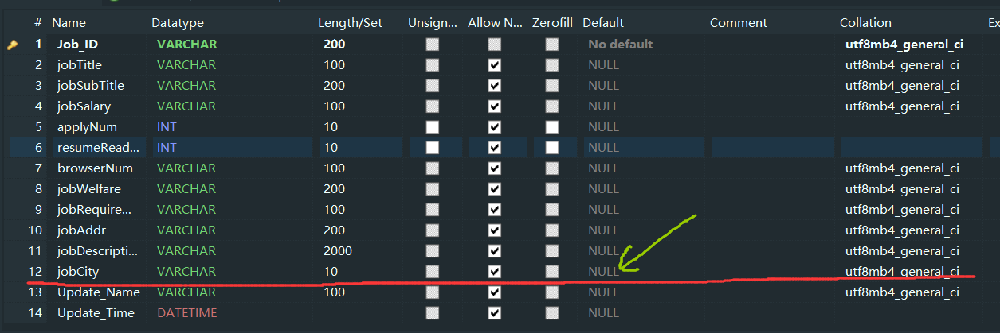

## 数据划分思路

- 我们现在拥有四个城市招聘数据 2w 余条，每个城市 5000 条，城市分别为： 北京/bj、上海/sh、深圳/sz、广州/gz；

- 现在要从每个城市的 5000 条中选取 2160 条，总计 8640 条交由人工识别；

- 每条信息都要同时交给两个人来判断，所以将每个城市的 2160 条划分为 3 份，我们四个加上师兄五个人，再加上我的室友们（算一个人），一共六个人一人一份 720 条，其中我和我的室友们判断同一份，师兄和付判断同一份，杰和雷两个人判断同一份

**四个城市，所以一个人总共需要判断 2880 条**

## 数据划分步骤

> 由于我们每个人爬取的都是不同的城市，所以数据不必在我这里汇总，直接在你们那里进行划分

### 一、为职位表增加城市字段

如下图，在 recruitment 表中增加 jobCity 字段，类型为 VARCHAR，长度为 10，勾选Allow NULL，Default 设为你爬取的城市缩写（即图中黄色箭头所指的位置），比如北京为： bj，不要乱改，最后保存。

强迫症的话还可以将 Default 改回 NULL。

当然，你也可以直接增加 jobCity 字段 Default 为 NULL，然后再执行全体数据更新 jobCity 为你当前的城市。

请务必正确无误的完成这一步

### 二、执行多个 sql 语句合并三个表

此步骤将用到我上传的文件夹 sql 中的 sql 脚本

**首先将 issue 和 recruitment 两个表合并存入一个视图：ir 之中**

执行 sql：createViewIR.sql

**然后合并 ir 和 company并存入一个视图：cir 之中**

执行 sql：createViewCIR.sql

**最后从视图 cir 中选出 2160 条数据并存入表：cir58 之中**

执行 sql：createTableCIR58.sql

### 三、导出 cir 为excel表格并分割表格

此步骤将用到我上传的文件夹 script 中的 python 脚本

**导出**

打开 db2excel.py，修改数据库配置处的配置，然后运行

**分割**

打开 split.py，修改代码最上方的城市缩写为你自己的，然后直接运行。

### 四、查看结果

参考结果为：

