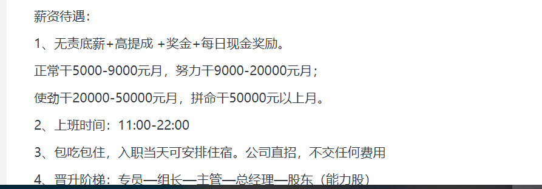

## 判断结果规范

1. 每一条信息后面都会有 **Real/Fake** 这一字段，真就填 1，假就填 0
2. 判断结束或者定期，判断相同数据的两个人要对比各自的判断结果，有争议的结果要进行讨论，如果两个人讨论还是不可以得出结果（即彼此无法说服双方）那就请把 **Real/Fake** 这一字段置为 2，并保留原位置的标记（没有请加上）

差不多就是这样，关于第三点对比判断结果这一步，假如需要对比的数据太多，我可以写一个脚本对两个人的判断结果进行合并，所以千万按照格式进行判断

## 判断规则/方法

### 1. 去除无用属性

> 打对号的要留下的属性，没打对号是要被筛除的属性

**company-58**

- [ ] Company_ID
- [x] positionTotal
- [ ] companyBaseUrl
- [x] companyName
- [ ] companyTrade
- [x] companyCharacter
- [x] feedbackRation
- [x] companySize
- [x] companyAddr
- [x] companyIntro
- [ ] companyType
- [ ] teamTime
- [ ] entUrl
- [ ] companyDetailUrl

**company-ent**

- [x] businessScope
- [x] creditCode
- [x] operatingStatus
- [x] orgNumber
- [x] regAddress
- [x] regAuthority
- [x] regCapital

**recruitment**

- [ ] Job_ID
- [x] jobTitle
- [x] jobSubTitle
- [x] jobSalary
- [x] applyNum
- [x] resumeReadPercent
- [ ] browserNum
- [x] jobWelfare
- [x] jobRequirement
- [x] jobAddr
- [x] jobDescription
- [ ] jobCity

**issue**

- [ ] jobUpdateTime
- [x] needNumber
- [ ] jobDetailUrl

### 2. 剩余属性的判定规则

> 属性的详细说明请前往：[58 同城数据库详细说明及分析](../DB.md)
>
> 以下判断规则肯定不全，所以请在根据此规则判断的同时加入自己的判断

**issue**

| 属性名     | 简要说明                               | 异常点 |
| ---------- | -------------------------------------- | ------ |
| needNumber | 职位需求人数，或者成为职位提供岗位数目 | 无     |

**recruitment**

| 属性名            | 简要说明                                                     | 异常点                                                       |
| ----------------- | ------------------------------------------------------------ | ------------------------------------------------------------ |
| jobTitle          | 无                                                           | 无                                                           |
| jobSubTitle       | 这个字段最容易看出问题，正常的招聘为对职位的补充描述，或者为职位要求的简要概括 | 1. 子标题与标题主题不对应；如： 2. 在子标题里提及工资或其他福利信息；如： |
| jobSalary         | 由于没有参考的职位平均工资也没办法获得，所以根据工资范围判别不太现实 | 3. 除了工资属性，在子标题、职位描述处多处强调工资，并且这几处换算出来的工资各自不相同且差异很大，如：  |
| applyNum          | 无                                                           | 无                                                           |
| resumeReadPercent | 首先要纠正一个很容易进入的误区，查看简历的意思是下载并查看，而公司即使不下载简历也可以看到你的信息。不能仅仅通过百分比高低就冒然进行判别 | 4. applyNum < n，n 是一个阈值，大于 n 说明这个招聘收到了很多申请，反之；那么正常的招聘由于申请人数小那么他的阅读百分比一般都要很大，这个规律简单点说就是，随着 n 的减小，阅读百分比逐渐接近于 100； 5. applyNum > n，与 1 相对应，随着 n 的增大，阅读百分比逐渐减小，具体减小到什么程度，取决于这个招聘提供的岗位数目为多少。 综上，加入阅读百分比的值不满足上面两条规律，可以认为异常，n 值我认为可以设置为：**needNumber * 5** |
| jobWelfare        | 俗话说得好：便宜没好货，那么对于职位福利来说，公司可以提供的福利应该是与薪资成正比的，举个例子，一个月5000的工资，然后公司除了基本福利还提供很多要公司花钱的额外福利，显然是不可能的。 | 6. 福利太差，基本的福利都不全的 7. 福利太好，很多收集简历的人员，大多不太了解行业内的福利，他们往往一股脑的提供几乎所有的福利或者提供很多诱人的福利，例如房补、车补、保底薪资之类，还是那句话，一个月 5000 的工资，福利怎么可能会这么好 |
| jobRequirement    | 学历要求及工作要求，这个要结合职位内容进行判断，你说，假如要找一个会计，然后学历不限，工作经验不限不太现实吧 | 8. 对于一些显然需要具备一定专业知识的职位，却声称学历不限工作经验不限等等 9. 虽然职位本身确实不需专业知识，可以要求学历不限工作经验不限，但是提供的工资又比较高，很可疑。 |
| jobAddr           | 一般都为正确地址                                             | 无                                                           |
| jobDescription    | 最关键的属性，一般的职位描述应包括以下几个方面（都类似）： 1. 职责描述：描述职位工作、责任 2. 任职资格/要求：职位要求 3. 工作时间 4. 详细介绍福利 5. 薪资介绍 | 10. 提示加其他联系方式直接联系（这种情况很少见，只要见到就是假的） 11. 除了前面说的 5 个方面，其余出现的都是没有用的信息，这类信息出现的越多越可疑 12. 职位描述有明显的煽动性，也就是表达出力求你的加入这种感情 13. 职责描述里面出现关键词，类似：在家就可以做，做自己的老板，为自己的未来做主，收入高，容易赚钱，无需任何条件等等等等，**这里的关键词，请各位在进行判断的时候遇到一个记下一个** 14. 职责描述河任职资格中是否关于职责和资格的部分被一笔带过，更加强调福利和薪资 15. 福利和薪资部分是否过于夸张了，或者描述是否太短了 |

**company**

| 属性名           | 简要说明                                                     | 异常点                                                       |
| ---------------- | ------------------------------------------------------------ | ------------------------------------------------------------ |
| positionTotal    | 发布职位数，主要用于判别此公司是不是属于广撒网的那种类型     | 结合其他属性分析                                             |
| companyName      | 无                                                           | 无                                                           |
| companyCharacter | 公司性质，公司的营业信息是可以被伪造的，但是对于一些国企类型的公司还是可以放心的 | 16. 国企企业可以认为是真实的                                 |
| feedbackRation   | 和之前的简历查看百分比类似，这里也有误区： 1. 反馈率是对于一个公司收到的所有简历而言的，所以反馈率是作为一个评价公司的属性，而不是用来评价招聘职位的 2. 公司可以在不查看简历的情况下对简历进行标记（反馈），在数据库介绍里提到的查看百分比一般大于等于反馈率，也只是说的一般，万万不可将两者之间的联系看的过于紧密，直白点，两者相差非常大也是有可能的。 | 17. 当公司发布的所有职位收到了一定数目的简历，那么假如反馈率过小，可以认为这个公司对于投递人员并不感兴趣，很大可能对简历更加感兴趣，有收集简历的可能； 18. 反馈率过大时，说明这个公司对投递人员更加感兴趣，有忽悠人员入职的可能，这也是一种虚假； |
| companySize      | 公司规模和发布职位数及职位提供岗位数的关系非常密切。         | 19. 公司所有职位需求人数加在一起 > companySize * x ，其中 x 是一个阈值，代表这家公司的招人极限，取值范围为（0,1），大于 companySize * x 说明 公司发布的所有职位需求的人数超出了招人极限，这显然是不现实的，举个例子，一家 50 人的小型公司，在 58 同城仅仅一个招聘网站上就需求 20 人，你觉得可能吗？ |
| companyAddr      | 无                                                           | 20. 可以简单对比一下与发布职位的地址的相似度。               |
| companyIntro     | 有的公司没有介绍                                             | 21. 主要看一下有没有介绍、介绍正不正规以及介绍是不是太短了，还有就是公司介绍是不是主要提及了招聘职位信息 |
| businessScope    | 除国家规定特殊行业如：烟.酒.药瓶.等等 基本啥都能经营。   | 22. 对于一些规模较小的公司，假如他的经营范围非常的广，这显然是非常不合理的，尽管这些都符合规定，但是不符合经营一家公司的常理，这样也属于异常 23. 经营范围介绍的过于宽泛，不详细，只有大类。 |
| creditCode       | 无                                                           | 24. 没有不行                                                 |
| operatingStatus  | 无                                                           | 25. 除了开业和存续或者类似的意思，其他属于异常               |
| orgNumber        | 无                                                           | 26. 没有不行                                                 |
| regAddress       | 无                                                           | 27. 没有不行                                                 |
| regAuthority     | 无                                                           | 无                                                           |
| regCapital       | 无                                                           | 无                                                           |

**我认为，人工判别阶段。假如一条招聘信息满足以上 1/4 的异常点，就可以认为这条信息为假**

### 3. 判别过程、

> 你可以先对招聘信息大体浏览自行判断，假如模棱两可，那么就可以参考此判别规则，假如可以确定自己的结果，就无需参考此结果

设总异常点数目为 N = 27

1. 根据异常点标号的顺序对一条信息就行判断即可
2. 异常点判别完成之后，记录信息异常的数目 count，假如 count >= 9，就将结果设为假（即 0），count < 9，就将结果设为真（即 1）

**由于信息是按照公司组织的，所以一般判断公司的一定数目的信息的结果相差不大，那么可以判断公司剩余的招聘信息也和之前的判定结果一样**

